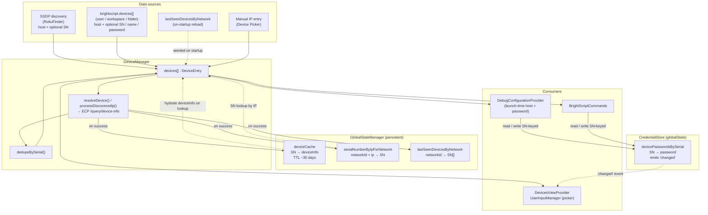
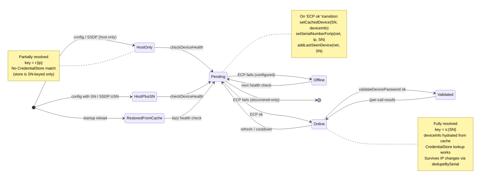
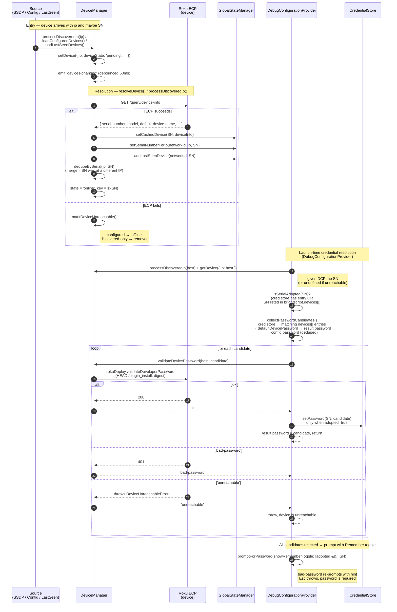
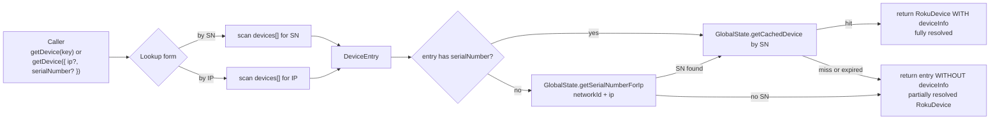

# Device Architecture (internal)

> Developer-facing companion to [device-discovery.md](./device-discovery.md).
> Focuses on how data flows internally — sources, resolution, persistence, lookup, and credential resolution. UI is intentionally glossed over.

Devices are **incrementally resolved**. A device can exist at several stages of completeness, and each stage unlocks different capabilities (IP routing → credential lookup → cache restoration). The sections below describe the pieces in that order, then the launch-time password resolution that sits on top.

---

## 1. High-level architecture

Four data sources feed a single in-memory registry (`DeviceManager.devices[]`). Resolution enriches entries by calling the device's ECP endpoint, and the results are fanned out into three long-lived caches plus the SN-keyed credential store. At launch time, `DebugConfigurationProvider` re-probes the resolved host and runs a candidate-based password flow against the cred store + settings.

Key implementation anchors:

- Registry and entry shape: [src/deviceDiscovery/DeviceManager.ts:1195-1239](../src/deviceDiscovery/DeviceManager.ts#L1195-L1239)
- Resolution: [src/deviceDiscovery/DeviceManager.ts:799-858](../src/deviceDiscovery/DeviceManager.ts#L799-L858)
- Config loader: [src/deviceDiscovery/DeviceManager.ts:668-797](../src/deviceDiscovery/DeviceManager.ts#L668-L797)
- SSDP / manual-IP entry: [src/deviceDiscovery/DeviceManager.ts:993](../src/deviceDiscovery/DeviceManager.ts#L993)
- `validateDevicePassword`: [src/deviceDiscovery/DeviceManager.ts:393-404](../src/deviceDiscovery/DeviceManager.ts#L393-L404)
- Three persistent caches: [src/GlobalStateManager.ts](../src/GlobalStateManager.ts)
- Credentials: [src/managers/CredentialStore.ts](../src/managers/CredentialStore.ts)
- Launch-time host + password resolution: [src/DebugConfigurationProvider.ts:463-582](../src/DebugConfigurationProvider.ts#L463-L582)

---

## 2. Device state lifecycle

A device moves through these states as it becomes more completely known. "Partial" vs "fully resolved" is the distinction between the left half (no SN yet) and the right half (SN known, `deviceInfo` cached).

Things that commonly surprise:

- **The `key` flips when SN is learned.** It's `i:{ip}` while the device is host-only and `s:{SN}` after resolution. Lookups by either form work during the transition window.
- **Configured devices never disappear on failure**, they just go `offline`. Only *discovered-only* entries get removed on health-check failure.
- **`Validated` is not a stored state**. Password validation returns `'ok' | 'bad-password' | 'unreachable'` from `DeviceManager.validateDevicePassword`, which delegates to `rokuDeploy.validateDeveloperPassword` (HEAD `/plugin_install` over digest auth). The result is a per-call branch key, not a field on the entry.
- **Adoption is a separate axis from resolution.** A device can be online and fully resolved without being "adopted" by the user. Adoption status gates whether the launch-time flow is allowed to write a validated password back to the cred store. See section 5.

---

## 3. Resolution sequence (end-to-end)

This is the happy path from "device appears" through "password validated", showing the cache writes.

Useful anchors:

- `processDiscoveredIp`: [src/deviceDiscovery/DeviceManager.ts:993](../src/deviceDiscovery/DeviceManager.ts#L993)
- `fetchDeviceInfo` + cache writes: [src/deviceDiscovery/DeviceManager.ts:943-971](../src/deviceDiscovery/DeviceManager.ts#L943-L971)
- `dedupeBySerial`: [src/deviceDiscovery/DeviceManager.ts:541-568](../src/deviceDiscovery/DeviceManager.ts#L541-L568)
- `validateDevicePassword`: [src/deviceDiscovery/DeviceManager.ts:393-404](../src/deviceDiscovery/DeviceManager.ts#L393-L404)
- `processHostParameter`: [src/DebugConfigurationProvider.ts:463-493](../src/DebugConfigurationProvider.ts#L463-L493)
- `processPasswordParameter`: [src/DebugConfigurationProvider.ts:511-582](../src/DebugConfigurationProvider.ts#L511-L582)
- `getActiveHostPassword`: [src/BrightScriptCommands.ts:898-908](../src/BrightScriptCommands.ts#L898-L908)

---

## 4. Lookup & hydration

`getDevice()` is the universal read path. It finds an entry, then tries to hydrate `deviceInfo` from the persistent cache — that's what turns a partial entry into a fully-resolved `RokuDevice`.

Consequence worth internalizing: the IP→SN map (`serialNumberByIpForNetwork`) is the bridge that lets a *config entry with just a host* still get a cached `deviceInfo` without re-hitting the device — but only after the first successful resolution on this network has written the mapping.

`networkId` is a SHA256 hash of the active network interfaces (see `getNetworkHash` in [src/deviceDiscovery/NetworkChangeMonitor.ts](../src/deviceDiscovery/NetworkChangeMonitor.ts)). Switching WiFi networks rotates the id, so per-network maps don't bleed across environments. The `deviceCache` itself is not network-scoped — once an SN's `deviceInfo` is cached, it hydrates on any network.

---

## 5. Credential resolution (launch time)

Password resolution is owned by `DebugConfigurationProvider.processPasswordParameter`. It runs once per launch, after the host has been resolved and probed. The shape is: drain legacy → check adoption → walk a deduped candidate list → prompt with retry.

### Read precedence (candidate order)

For a launch with a known SN, candidates are gathered in this order, then deduped while preserving first occurrence:

1. `CredentialStore.getPassword(SN)` — globalState SN-keyed store
2. Every `brightscript.devices[].password` entry whose `serialNumber` matches the SN, scanned across user / workspace / each workspace folder scope
3. `brightscript.defaultDevicePassword` (workspace-wide fallback)
4. `result.password` — merged user/workspace settings + config
5. `config.password` — raw launch.json value

The four legacy variables (`${promptForHost}`, `${activeHost}`, `${promptForPassword}`, `${activeHostPassword}`) are filtered out so they're effectively no-ops — defaulted password slots fall through to the candidate flow regardless of which placeholder the user typed.

When SN is unknown (host unreachable at probe time, or not a developer-mode Roku), only candidates 3-5 are considered.

### Adoption gating

A device is "adopted" when the user has explicitly signalled ownership — either by storing a password for the SN in the cred store, or by listing the SN in `brightscript.devices[]` in any scope. `isSerialAdopted(SN)` is computed once at the top of the flow.

The `acceptPassword(result, password, SN, adopted)` helper writes the winning password to the result config and the workspace-global `remotePassword` fallback, but only writes to `CredentialStore` when `adopted === true`. This prevents the extension from silently persisting credentials for passively-discovered devices the user has not opted into.

The legacy migration path always passes `adopted = true`: a pre-existing IP-keyed entry is itself an explicit historical opt-in.

### Validation loop

For each candidate in order, the flow calls `validateDevicePassword(host, candidate)`:

- `'ok'` → `acceptPassword`, return.
- `'bad-password'` → try next candidate.
- `'unreachable'` → throw `"Debug session terminated: device at {host} is unreachable."`. The flow does not fall through to legacy stores when the device is unreachable; the user can't debug it anyway.

If every candidate is rejected with `'bad-password'`, the flow prompts via `promptForPassword`. Un-adopted devices with a known SN see an inline "Remember this password" toggle (an icon button on the input box, not a follow-up popup); adopted devices and devices without an SN don't see the toggle. A bad typed password re-prompts with a "rejected, try again" placeholder; Esc throws `"password is required"`.

### Legacy `workspaceState.devicePasswords` migration

The old IP-keyed password store is **drain-only**. Reads never consult it. Before the candidate loop runs, `processPasswordParameter` peeks the legacy entry for the resolved IP:

- `'ok'` → write to cred store (always, since this is an explicit historical opt-in), delete the legacy entry, accept the password, return.
- `'bad-password'` → delete the legacy entry (proven wrong, dead weight) and fall through to the normal flow.
- `'unreachable'` → leave the legacy entry alone (it may still be correct on a future attempt) and fall through.

Anchors:

- `processPasswordParameter`: [src/DebugConfigurationProvider.ts:511-582](../src/DebugConfigurationProvider.ts#L511-L582)
- `collectPasswordCandidates`: [src/DebugConfigurationProvider.ts:639-685](../src/DebugConfigurationProvider.ts#L639-L685)
- `acceptPassword`: [src/DebugConfigurationProvider.ts:695-706](../src/DebugConfigurationProvider.ts#L695-L706)
- `isSerialAdopted`: [src/DebugConfigurationProvider.ts:714-738](../src/DebugConfigurationProvider.ts#L714-L738)
- `promptForPassword` (with toggle): [src/DebugConfigurationProvider.ts:590-632](../src/DebugConfigurationProvider.ts#L590-L632)
- Legacy peek/drain helpers: [src/DebugConfigurationProvider.ts:740-769](../src/DebugConfigurationProvider.ts#L740-L769)

---

## 6. Partially vs fully resolved — quick reference

| Aspect | Partially resolved | Fully resolved |
|---|---|---|
| Has `serialNumber`? | No | Yes |
| `key` | `i:{ip}` | `s:{SN}` |
| `deviceState` | `pending` (or `offline`) | `online` |
| `deviceInfo` | undefined | hydrated from `deviceCache` |
| Credential lookup | Not possible (store is SN-keyed) | `CredentialStore.getPassword(SN)` |
| Eligible for adoption | No (no SN to key against) | Yes (via cred store entry or `brightscript.devices[]`) |
| Auto-write of validated pw | No | Only when adopted |
| Survives IP change | No (treated as new device) | Yes (`dedupeBySerial` merges) |
| Restored on startup | Only via `brightscript.devices[]` config | Via `lastSeenDevicesByNetwork` + `deviceCache` |
| How it becomes fully resolved | `resolveDevice()` / `processDiscoveredIp()` → ECP `/query/device-info` | — |

---

## 7. Things intentionally not shown

- **Scan pacing** (stale thresholds, settle windows, queued-scan flag) — covered in [device-discovery.md](./device-discovery.md).
- **Network change / sleep monitors** — they trigger reloads and queue scans but don't change the resolution model.
- **View providers** (`DevicesViewProvider`, Device Picker) — they consume `getAllDevices()` + `'devices-changed'` and subscribe to `CredentialStore.on('changed')` for password-presence indicators; they don't participate in resolution.
- **Legacy launch-config variables** (`${promptForHost}`, `${activeHost}`, `${promptForPassword}`, `${activeHostPassword}`) — still accepted in launch.json for backwards compatibility, but treated identically to empty/missing. The default flow does the right thing in all cases.
- **Per-workspace `remoteHost` / `remotePassword`** — still written and read as the active-device pointer + global password fallback. Not yet SN-keyed (deferred follow-up).
